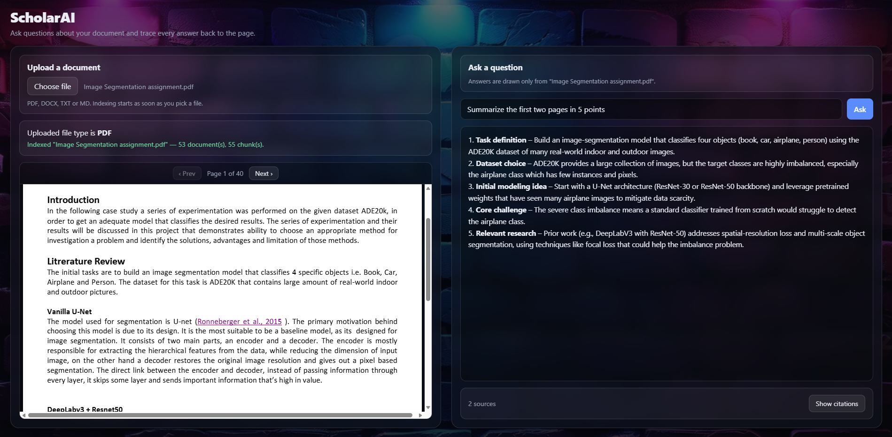
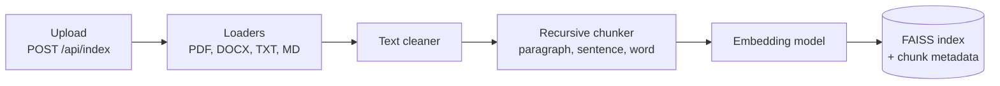
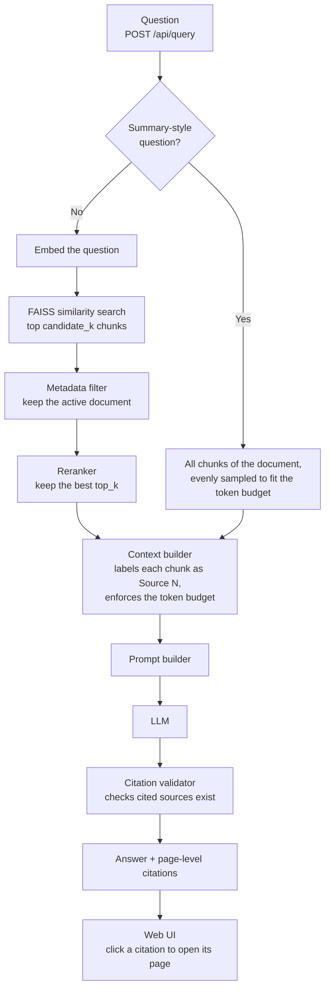

# ScholarAI

**Ask questions about a document and trace every answer back to the page it came from.**

[](https://github.com/San0160/ScholarAI/actions/workflows/ci.yml)


ScholarAI is a retrieval-augmented generation (RAG) system built from scratch, without LangChain or any other orchestration framework. Every stage (loading, cleaning, chunking, embedding, retrieval, reranking, prompt assembly and citation checking) is plain Python that you can read, test and replace.

**Live demo:** <!-- TODO: replace with your Railway link --> https://YOUR-APP.up.railway.app

**Video walkthrough:** <!-- TODO: replace with your LinkedIn post link --> [Watch the demo on LinkedIn](https://www.linkedin.com/posts/YOUR-POST)

<!-- TODO: save a screenshot of the app as docs/screenshot.png. Clicking it opens the video. -->
[](https://www.linkedin.com/posts/YOUR-POST)

## What it does

- Upload a PDF, DOCX, TXT or Markdown file. Indexing starts as soon as the file is picked.
- Preview the document next to the chat: PDFs page by page, text files as plain text.
- Ask a question. Answers are drawn only from the uploaded document.
- Open the citations under an answer and click one to jump the preview to that page.
- Ask for a summary and the system reads across the whole document instead of searching for a few passages.

## Architecture

### Indexing a document



### Answering a question



### How the code is organised

Three pipelines do the orchestration, and each one is assembled from small parts that sit behind a base class and a factory.

| Pipeline | Responsibility |
| --- | --- |
| `IndexingPipeline` | load, clean, chunk, embed, store |
| `RetrievalPipeline` | search, filter, rerank |
| `GenerationPipeline` | build context, prompt the LLM, validate and format citations |

```
src/ai_research_assistant/
├── api/            FastAPI app, routers, request/response schemas, error handlers, web UI (static/)
├── ingestion/      Document loaders for PDF, DOCX, TXT and Markdown
├── chunking/       Token-aware recursive chunker and its factory
├── embeddings/     Embedding backends (local Hugging Face, hosted API) and factory
├── vector_store/   FAISS vector store with atomic saves and thread safety
├── retrieval/      Vector retriever, metadata filter, question-type detection
├── reranking/      Reranker backends (hosted API, BGE, cross-encoder) and factory
├── generation/     Context builder and prompt builder
├── llm/            LLM backends and factory
├── citation/       Citation validation and answer formatting
├── pipeline/       Indexing, retrieval and generation pipelines
├── config/         Typed configuration loaded from config/config.yaml
├── entity/         Dataclasses: Document, RetrievalResult, config entities
├── utils/          Token counting and citation helpers
├── logging/        Rotating file and console logging
└── exception/      Internal exception with file and line capture
```

### Design choices

- **No framework.** The goal was to understand and control each step of RAG instead of configuring someone else's abstraction.
- **Two-stage retrieval.** A fast vector search gathers a wide set of candidates, then a reranker picks the few that are passed to the LLM.
- **Citations are checked, not trusted.** The LLM is asked to cite the numbered sources it was given. Any source number it invents is detected and never shown.
- **Swappable providers.** The LLM, embedding model and reranker are each chosen in `config/config.yaml`. Adding a provider means writing one class and registering it in a factory.
- **Token budgets.** The context is sized to stay inside the LLM provider's rate limit, which matters on free tiers.
- **Fresh start.** The index and uploads are cleared every time the server starts, so each run begins empty.

## Tech stack

| Layer | Used here |
| --- | --- |
| API and UI | FastAPI, vanilla HTML/CSS/JS, PDF.js |
| Parsing | PyMuPDF, python-docx |
| Vector search | FAISS (inner product on normalised vectors) |
| Embeddings | Hugging Face model, set in `config.yaml` |
| Reranker | `nvidia/llama-nemotron-rerank-vl-1b-v2` through NVIDIA NIM |
| LLM | `openai/gpt-oss-120b` through Groq's OpenAI-compatible API |
| Deployment | Docker, Railway, GitHub Actions for CI |

## Getting started

### Requirements

- Python 3.10 or newer
- A [Groq](https://console.groq.com) API key for the LLM
- An [NVIDIA NIM](https://build.nvidia.com) API key for the reranker

### Install

```bash
git clone https://github.com/San0160/ScholarAI.git
cd ScholarAI

python -m venv .venv
# Windows
.venv\Scripts\activate
# macOS / Linux
source .venv/bin/activate

pip install -r requirements.txt
pip install -e .
```

### Add your keys

Create a file named `.env` in the project root. It is ignored by git.

```
GROQ_API_KEY=your_groq_key
RERANKER_API_KEY=your_nvidia_key
```

### Run

```bash
uvicorn ai_research_assistant.api.app:app --reload
```

Open http://127.0.0.1:8000 for the app, or http://127.0.0.1:8000/docs for the interactive API reference.

### Run with Docker

```bash
docker build -t scholarai .
docker run -p 8000:8000 --env-file .env scholarai
```

## API

| Method | Path | Purpose |
| --- | --- | --- |
| `POST` | `/api/index` | Upload and index one file (`multipart/form-data`, field `file`, optional `rebuild=true`) |
| `POST` | `/api/query` | Ask a question (JSON) |
| `GET` | `/health` | Health check |
| `GET` | `/` | Web UI |

```bash
# Index a document
curl -F "file=@paper.pdf" http://127.0.0.1:8000/api/index

# Ask a question about it
curl -X POST http://127.0.0.1:8000/api/query \
  -H "Content-Type: application/json" \
  -d '{"question": "What optimizer was used?", "metadata_filters": {"filename": "paper.pdf"}}'
```

A query response looks like this:

```json
{
  "answer": "The model was trained with the Adam optimizer.",
  "citations": [
    { "source": "paper.pdf", "page": 4, "start_char": 120, "end_char": 980 }
  ]
}
```

`metadata_filters` restricts the answer to one file. `top_k` (optional, 1 to 20) overrides how many passages are kept after reranking.

## Configuration

Everything tunable lives in `config/config.yaml`.

| Section | What it controls |
| --- | --- |
| `llm` | Provider, model, API base URL, context and output token limits |
| `embeddings` | Provider and model used to embed chunks and questions |
| `chunking` | `chunk_size` and `chunk_overlap`, in tokens |
| `retrieval` | `candidate_k`, how many chunks the vector search returns |
| `reranking` | Provider, model and `top_k`, how many chunks reach the LLM |
| `vector_store` | Where the FAISS index is stored |

To switch a provider, change `provider` and `model` in the relevant section. No code changes are needed for providers that already exist.

## Limitations

- One document is active at a time in the web UI.
- Scanned or image-only PDFs are not supported (no OCR).
- Preview is available for PDF, TXT and Markdown. DOCX files are indexed but not previewed.
- Each question is independent. There is no chat history yet.
- On Groq's free plan the context is capped to stay under the per-minute token limit, so very long documents are sampled for summaries.
- The deployed demo is shared: all visitors use the same index and the same API quota.

## Roadmap

- An evaluation suite: retrieval hit rate with and without the reranker, citation accuracy and answer faithfulness
- Unit tests for the chunker, text cleaner, citation utilities and context builder
- Keep section headings in the indexed text
- Chat history and follow-up questions
- Page-range questions ("summarise pages 1 to 2")
- Clickable page markers on each point of an answer
- Per-visitor isolation and rate limiting for the public demo

## Contributing

Contributions are welcome, from bug reports to new providers.

1. Fork the repository and create a branch: `git checkout -b feature/short-description`.
2. Set up the project as described in [Getting started](#getting-started).
3. Make your change. Keep it focused on one thing.
4. Run the same checks CI runs:
   ```bash
   python -m compileall -q src
   python -c "from ai_research_assistant.api.app import app"
   ```
5. Start the app and try an upload and a question to confirm nothing broke.
6. Open a pull request that says what changed and why. CI must pass before it can be merged.

### Adding a provider

LLMs, embedding models, rerankers and vector stores all follow the same pattern:

1. Write a class that implements the base class in that folder (for example `BaseReranker` in `reranking/`).
2. Register it in the folder's factory under a new `provider` name.
3. Add any new settings to the matching config entity in `entity/config_entity.py` and to `config/config.yaml`.

### Conventions

- Low-level code raises `CustomException`. Pipelines translate failures into the API errors defined in `api/exceptions.py`, so users see a clean message and the log keeps the detail.
- Use `logging.getLogger(__name__)` in every module.
- Settings belong in `config/config.yaml`, not in code.
- Never commit `.env`, uploaded files or the vector index.

### Reporting a bug

Open an issue with what you did, what you expected, what happened, and the relevant lines from `logs/application.log`.

## License

Released under the MIT License.

## Author

**Sandeep Kumar** · [GitHub](https://github.com/San0160) <!-- TODO: add your LinkedIn profile link -->